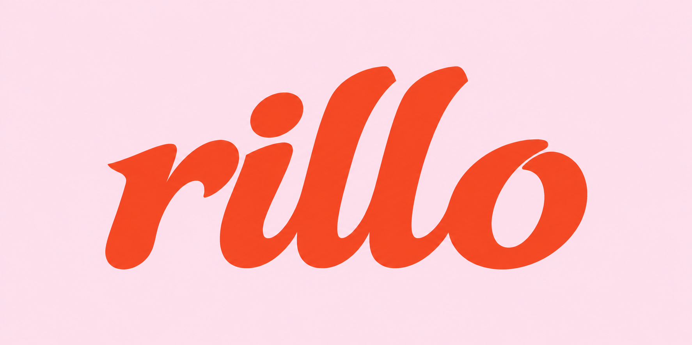
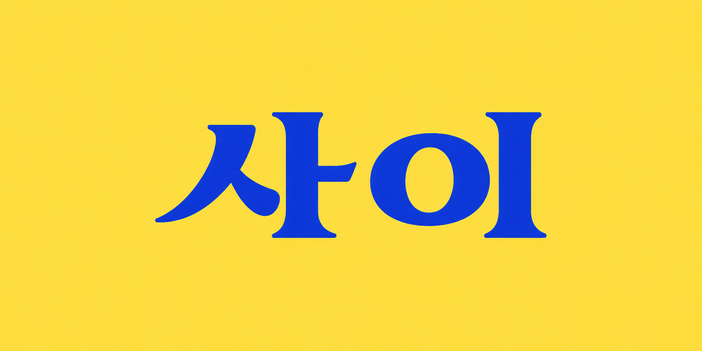
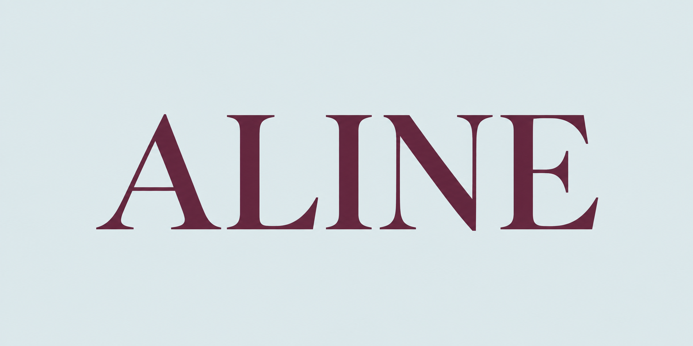
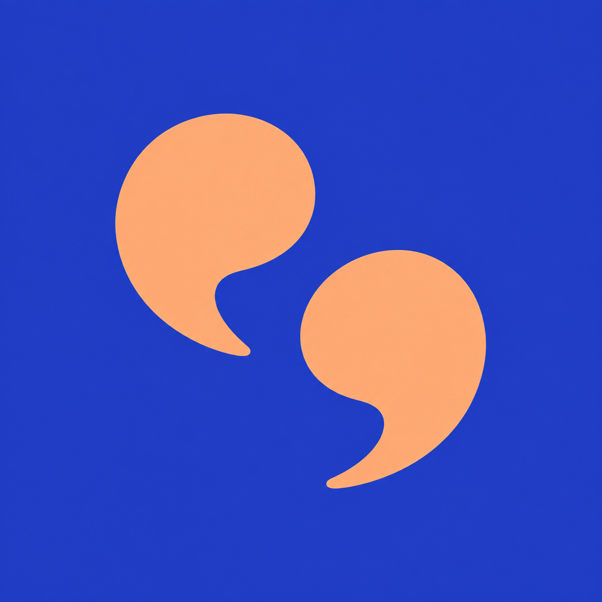
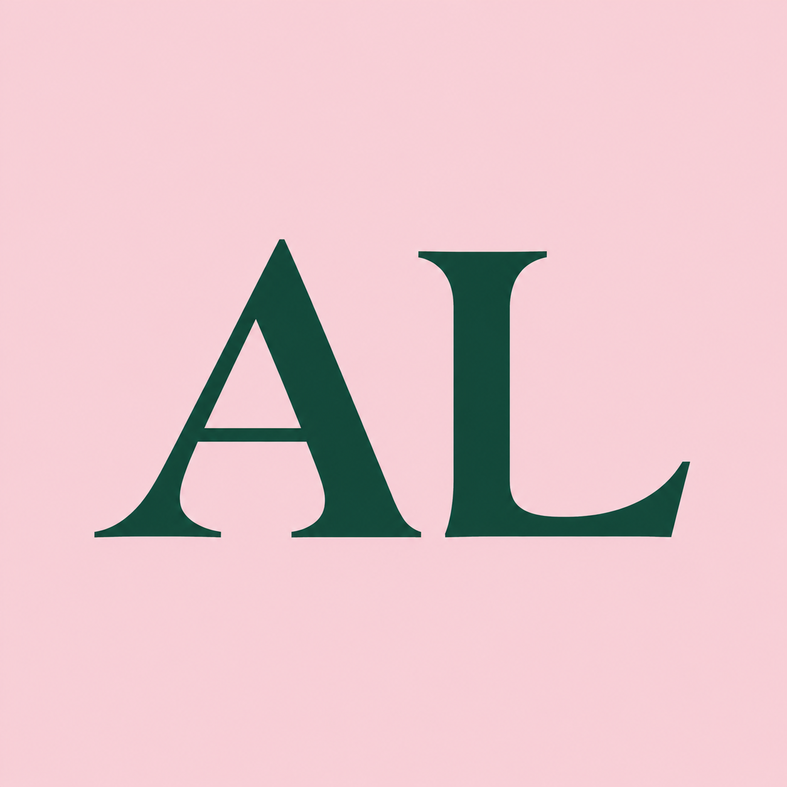
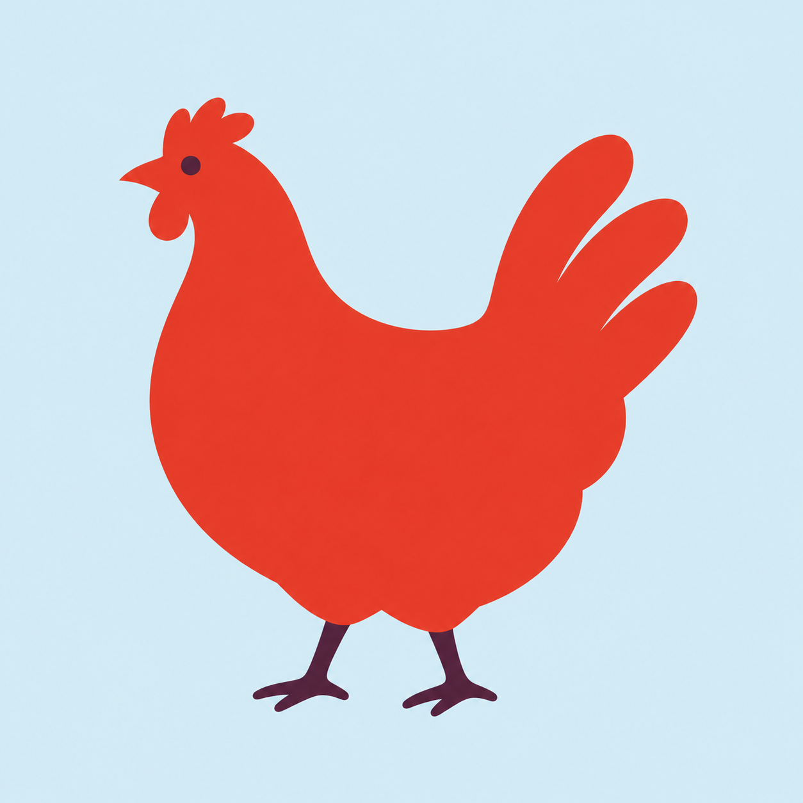
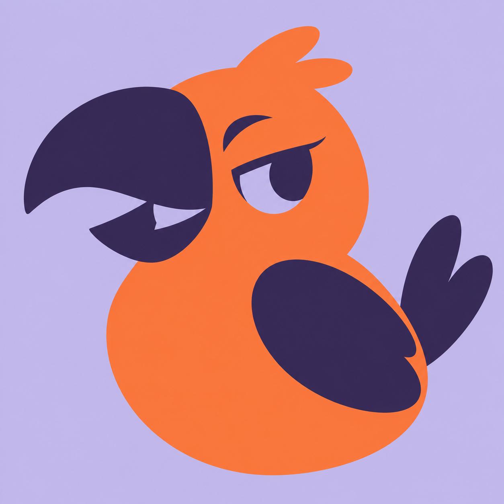
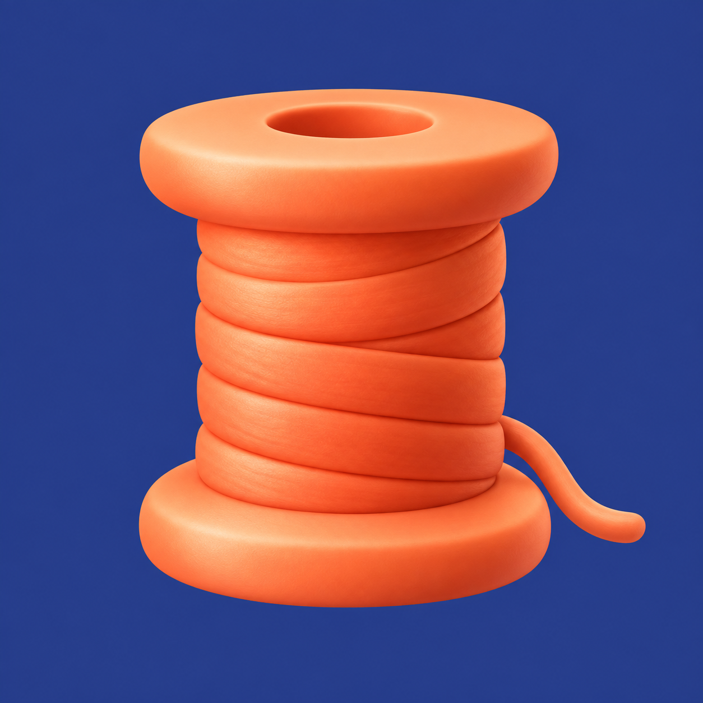

<p align="center">
  <a href="docs/brand/README.ko.md"></a>
</p>

<a id="logo-land-로고랜드"></a><a id="logopia"></a>
<h1 align="center">Logopia · 로고피아</h1>

<p align="center">
  <strong>이름에 어울리는 모양을 만들어 보세요.</strong><br>
  Codex 또는 Hermes와 대화하며 개성 있는 레터링, 브랜드 로고와 앱 아이콘 아트워크를 만드실 수 있습니다.
</p>

<p align="center">
  <a href="https://github.com/t1seo/logopia/releases/tag/v0.8.0"></a>
  
  
</p>

<p align="center">
  <a href="README.md">English</a> · <a href="README.ko.md">한국어</a> · <a href="docs/hermes.ko.md">Hermes</a> · <a href="#설치">Codex 설치</a> · <a href="docs/gallery.ko.md">갤러리</a> · <a href="docs/README.ko.md">문서</a>
</p>

<a id="샘플"></a><a id="샘플-10개"></a><a id="투명-배경-로고"></a><a id="use-cases"></a><a id="brand-studies"></a>

## 여덟 가지 브랜드 스터디

브러시 레터링, 한글, 로만 대문자, 심볼과 앱 아이콘을 서로 다른 가상 브랜드의 용도에 맞춰 제작했습니다. **이미지를 누르면 실제 원본 PNG가 열립니다.**

<table>
  <tr>
    <td align="center" valign="top" width="50%"><a href="docs/showcase/2026-10-01-brand-studies/images/01-rillo-v2.png"></a><br><strong>rillo</strong><br><sub>브러시 워드마크 · 과일 소다 패키지</sub></td>
    <td align="center" valign="top" width="50%"><a href="docs/showcase/2026-10-01-brand-studies/images/02-sai-v2.png"></a><br><strong>사이</strong><br><sub>한글 워드마크 · 책방·음악 감상 공간</sub></td>
  </tr>
  <tr>
    <td align="center" valign="top" width="50%"><a href="docs/showcase/2026-10-01-brand-studies/images/03-aline-v1.png"></a><br><strong>ALINE</strong><br><sub>에디토리얼 로만 워드마크 · 건축·공예 저널</sub></td>
    <td align="center" valign="top" width="50%"><a href="docs/showcase/2026-10-01-brand-studies/images/04-tandem-v1.png"></a><br><strong>TANDEM</strong><br><sub>심볼 · 일대일 대화 서비스</sub></td>
  </tr>
  <tr>
    <td align="center" valign="top" width="50%"><a href="docs/showcase/2026-10-01-brand-studies/images/05-al-v2.png"></a><br><strong>AL</strong><br><sub>이니셜 마크 · 건축 스튜디오</sub></td>
    <td align="center" valign="top" width="50%"><a href="docs/showcase/2026-10-01-brand-studies/images/06-red-hen-v1.png"></a><br><strong>RED HEN</strong><br><sub>그림 심볼 · 동네 베이커리</sub></td>
  </tr>
  <tr>
    <td align="center" valign="top" width="50%"><a href="docs/showcase/2026-10-01-brand-studies/images/07-pip-v1.png"></a><br><strong>Pip</strong><br><sub>마스코트 앱 아이콘 · 나만의 음성 메모</sub></td>
    <td align="center" valign="top" width="50%"><a href="docs/showcase/2026-10-01-brand-studies/images/08-spool-v1.png"></a><br><strong>Spool</strong><br><sub>소프트 3D 앱 아이콘 · 공예 프로젝트 기록</sub></td>
  </tr>
</table>

[여덟 스터디 HTML 갤러리](docs/showcase/2026-10-01-brand-studies/index.html) · [원본·정확한 프롬프트·편집 이력·검토 기록](docs/showcase/2026-10-01-brand-studies/README.md)

rillo·사이·AL은 부모 원본을 네이티브 편집한 v2이며, 나머지는 v1입니다. 모두 가상 브랜드의 래스터 스터디로, 사용자 채택이나 완성된 벡터 아이덴티티를 뜻하지 않습니다.

<a id="hermes-workflow"></a>

**현재 소스는 아직 발행하지 않은 0.10.0 업데이트입니다.** 디자인 판단을 맡기시면 브랜드 조사 → 서로 다른 아이디어 → 저장한 정확한 프롬프트로 원본 생성 → 실제 이미지 비평 → 수정·재설계·탈락의 과정을 제한된 횟수 안에서 진행합니다. 전문 아이덴티티 디자이너의 작업 방식을 조사해 페르소나의 역할과 인계 기준에 반영했습니다. 이미 확정한 타이포그래피와 자산은 제약으로 보존합니다. [로고 디자인의 기본](skills/logo-land/references/logo-foundations.md) · [반복 과정과 명령어](skills/logo-land/references/quality-loop.md) · [이전 결과의 실패 분석](docs/research/logo-quality-failure-audit-2026-10-01.md).

빠른 탐색에서는 요청하신 후보 수를 유지합니다. 품질 개선을 맡기는 모드는 **네이티브 호출 기본 6회, 최대 12회**이며, 수정·실패·결과 확인 불가도 같은 예산에 포함됩니다. 적합한 후보가 없다는 결론으로 종료할 수도 있습니다. 헬퍼는 요청과 근거를 기록하고 실제 이미지 호출은 호스트가 수행합니다. 코드가 미적 완성도를 판정하거나 좋은 로고를 보장하지는 않습니다. Hermes의 3×3 탐색은 계속 선택 사항이며, 해당 어댑터가 새 루프를 자동 실행하는 것은 아닙니다.

이전 0.9.0 작업은 브랜드 전략, 유효한 색상 역할과 타이포그래피를 생성에 전달하며 명시한 표현 스타일을 보존합니다. [조사와 설계 근거](docs/research/brand-output-quality-2026-10-01.md) · [변경 전후 원본 6장과 남은 한계](docs/qa/brand-output-quality-2026-10-01/README.md). Reference 입력, Asset별 PNG 검사와 블라인드 비교도 그대로 지원합니다. [이전 아이콘 실험](docs/research/icon-craft-2026/README.md). 9월 샘플은 과거 자료로 보존하며 0.9.0 또는 0.10.0의 결과물로 소개하지 않습니다.

## Hermes로 단계별 로고 만들기

**브리프 → 서로 다른 방향 → 원본 후보 → 이미지 검토 → 선택 → 부분 수정 → 전달.**

Hermes가 원본과 실제 사용할 크기를 두 번의 별도 이미지 검토로 확인합니다. 하나의 오프라인 화면에서 후보를 비교하고, 유지할 점과 바꿀 점을 보내 수정하실 수 있습니다. 이전 원본도 모두 남습니다. [Hermes로 시작하기](docs/hermes.ko.md).

<a id="앱-아이콘-12개"></a><a id="브랜드-로고-10개"></a>

9월 20일의 OFFCUT 두 방향·브랜드 로고 10개·앱 아이콘 12개는 [역사 갤러리](docs/gallery.ko.md#september-20-2026)와 [전체 원본·프롬프트](docs/showcase/2026-09-20-lifestyle/README.ko.md)에서 보실 수 있습니다. [과거 Hermes 수정·검토 사례](docs/hermes-demo/README.ko.md)도 별도로 보존했습니다.

<a id="시작하기"></a><a id="저장소에서-바로-사용"></a><a id="이미지-생성과-파일-보조-도구의-차이"></a>

## 설치

Codex 경로에는 **이미지 생성·편집 도구가 있는 Codex**, **Python 3.12 이상**, **uv**가 필요합니다. 이미지 도구가 그림을 만들고, 로컬 보조 도구는 프로젝트 저장·프롬프트 준비·파일 패키징을 맡습니다. 플러그인을 설치해도 없는 이미지 도구가 활성화되지는 않습니다.

```sh
git clone https://github.com/t1seo/logopia.git
cd logopia
uv sync --locked
codex
```

열린 Codex 대화에서 이렇게 시작해 주세요.

> skills/logo-land/SKILL.md를 읽고 따라 주세요. LUMA의 경쾌한 다색 워드마크를 만들어 주세요. 정확한 글자는 LUMA이며, 글자 자체가 디자인이 되도록 하고 별도 아이콘이나 슬로건은 넣지 말아 주세요.

<a id="codex-플러그인으로-설치"></a>

**다른 프로젝트에서 `$logo-land`를 사용하시려면** [전체 플러그인 설치 안내](docs/installation.ko.md)를 따라 주세요. 로컬 마켓플레이스 설정, 업데이트와 프로젝트 저장 위치를 설명합니다. 스킬 호출명은 기존 `$logo-land`를 사용합니다.

<a id="릴리스와-버전-관리"></a>

최신 발행 버전은 **[0.8.0](https://github.com/t1seo/logopia/releases/tag/v0.8.0)**입니다. [릴리스 안내](docs/qa/hermes-workflow/release-notes.md) · [변경 이력](CHANGELOG.md)

<a id="대화로-사용하기"></a>

## 이렇게 요청해 보세요

**디자인 과정부터 맡겨 보세요.**

> $logo-land 우리 브랜드를 조사하고 비평과 수정 루프를 거쳐 심볼을 만들어 주세요. 타이포그래피는 이미 확정했으니 글자는 생성하지 말아 주세요. 원본을 모두 보존하고, 남은 후보 중 가장 나은 것과 한계를 함께 보여 주세요.

**글자부터 시작해 보세요.** 워드마크는 브랜드 이름 자체를 로고로 만든 디자인입니다. 원하는 글자 모양과 리듬, 분위기를 설명하고 표기를 정확하게 적어 주세요.

> $logo-land 과일 소다 브랜드 rillo의 워드마크를 만들어 주세요. 정확한 소문자 rillo를 붉은 오렌지색 브러시 레터링으로 표현하고, 옅은 분홍 배경과 두 l의 구분을 유지해 주세요.

> $logo-land logopia의 오리지널 게임 타이틀 로고를 만들어 주세요. 정확한 소문자 logopia를 사용하고, 둥글고 다채로운 글자와 스티커 같은 윤곽을 흰색 배경에 표현해 주세요.

> $logo-land 물결의 한글 워드마크를 만들어 주세요. 정확한 글자는 물결이며, 굵고 둥근 글자에 민트와 라일락을 사용해 주세요. 한글이 또렷하게 읽히도록 하고, 별도의 파도 아이콘이나 문구는 넣지 말아 주세요.

**작은 마크와 캐릭터도 요청하실 수 있습니다.**

> $logo-land 건축 스튜디오의 이니셜 AL을 짙은 초록색과 분홍 배경으로 만들어 주세요. 두 글자가 각각 읽히도록 획의 무게와 간격을 조정해 주세요.

> $logo-land 음성 메모 앱 Pip의 아이콘을 만들어 주세요. 큰 곡선 부리를 가진 오렌지색·플럼색 새 한 마리를 라일락 배경에 표현하고, 글자는 넣지 말아 주세요.

<a id="앱-아이콘-방향-여섯-가지"></a><a id="네-가지-방식으로-색상-정하기"></a><a id="심볼과-정확한-글자-조합하기"></a><a id="로고-유형-8가지"></a><a id="수정과-전달-파일"></a>

<a id="만들-수-있는-것"></a>

## 첫 아이디어부터 전달 파일까지

| 만들 대상 | 시도할 수 있는 방향 |
|---|---|
| **레터링** | 경쾌한 다색·스포츠 워드마크, 게임 타이틀, 기하학적 이니셜, 한글·영문 브랜드명 |
| **브랜드 로고** | 워드마크, 레터마크, 모노그램, 심볼, 추상형, 조합형, 엠블럼, 마스코트 |
| **앱 아이콘 아트워크** | IP 캐릭터, 픽토그램, 추상형, 모노그램, 소프트 3D, 픽셀 아트 |

브랜드가 전할 의미를 설명하고, 어울리는 형태를 고른 뒤, 글자·간격·작은 크기에서의 식별성을 다듬어 보세요. 색은 직접 정하거나 Logopia에 제안을 맡기실 수 있습니다. 선택한 원본과 수정 이력을 저장하며 작업을 이어갑니다.

> 후보들을 한 갤러리에서 앱 홈 화면·웹 헤더·16px 크기로 비교해 주세요. 선택한 디자인의 글자와 색은 유지하고, 글자 사이 간격만 넓혀 주세요.

결과는 **래스터 PNG**입니다. 검수를 마친 내보내기에는 원본 PNG, ZIP과 간단한 브랜드 안내가 포함될 수 있습니다. 편집 가능한 벡터와 폰트 파일은 별도 작업이며, 폰트명은 시각적 참고입니다. 앱 아이콘은 플랫폼별 준비가 필요하고, 투명 배경은 별도로 요청하고 확인해야 합니다.

[레터링 안내](skills/logo-land/references/lettering.md) · [후보 비교와 수정](skills/logo-land/references/comparison-workflow.md) · [색상과 글자](docs/colors/README.ko.md) · [투명 PNG 예제](docs/samples/transparency.ko.md) · [이전 샘플 보관 자료](docs/gallery.ko.md#historical-outputs)

<a id="여섯-가지-사용-예제"></a><a id="10월-실험--디자인-품질-거절"></a>

[이전 실험·갤러리 보관 자료](docs/gallery.ko.md#historical-outputs)에는 앞선 여섯 결과의 품질 거절과 개선을 입증하지 못하고 중단한 Pebble 비교 기록을 그대로 보존했습니다.

<a id="조사와-제작-근거"></a>

## 후원

[](https://www.buymeacoffee.com/taewonseo)

## 출처

IP 캐릭터 지침은 [s1dashu/ip-as-logo-skill](https://github.com/s1dashu/ip-as-logo-skill)을 바탕으로 각색했습니다. [고정된 원본과 각색 안내](skills/logo-land/references/ip-mascot.md), [MIT 라이선스 고지](skills/logo-land/assets/ip-as-logo.LICENSE), [제3자 출처 고지](THIRD_PARTY_NOTICES.md)를 확인해 주세요.

[문서](docs/README.ko.md) · [Logopia 로고](docs/brand/README.ko.md) · [도움 요청](https://github.com/t1seo/logopia/issues)
