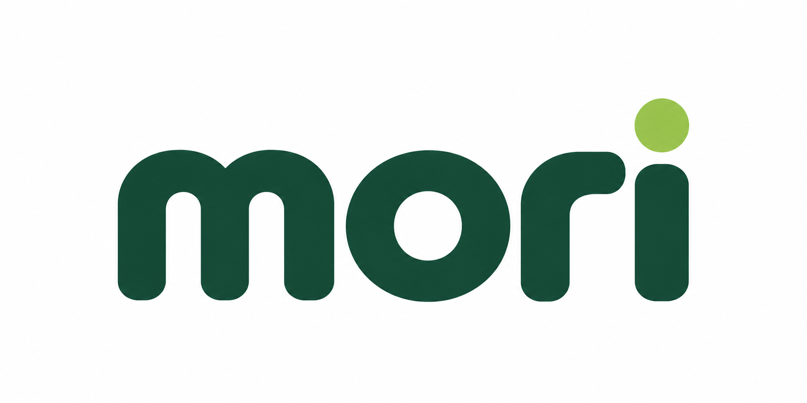
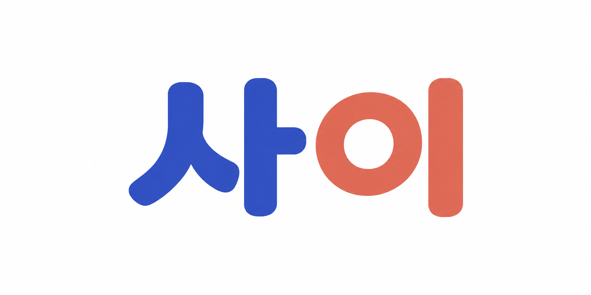
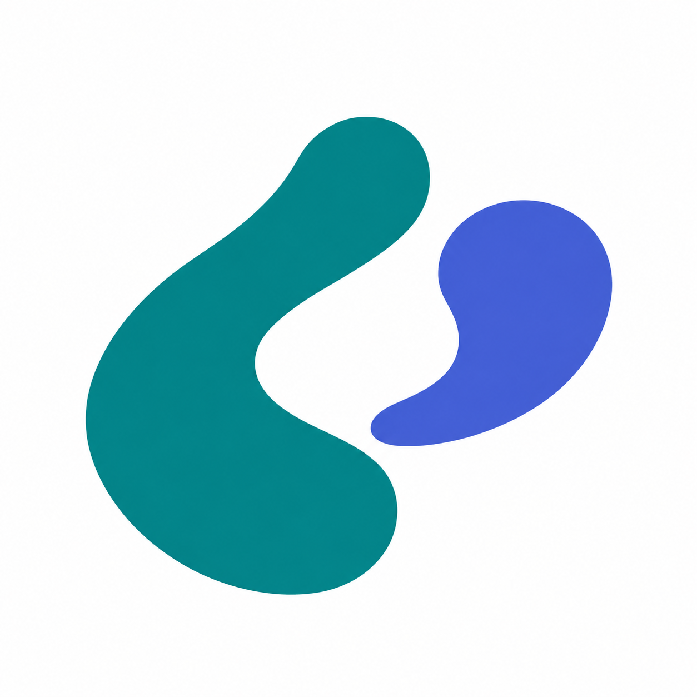
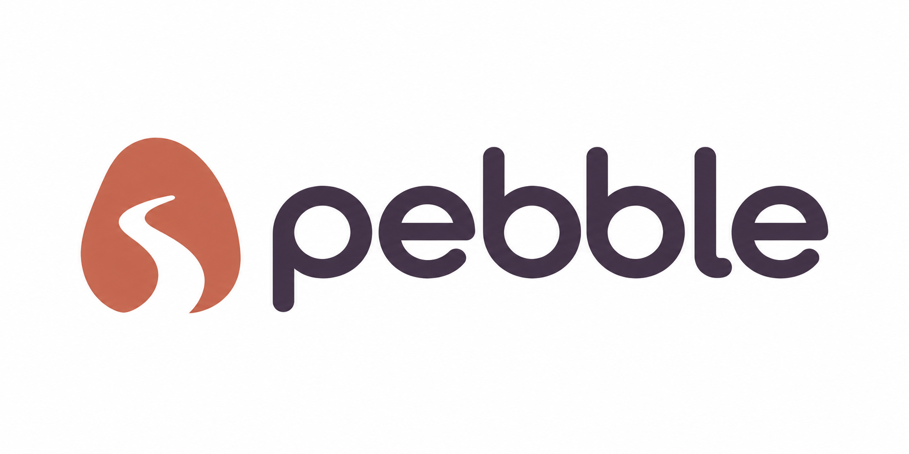
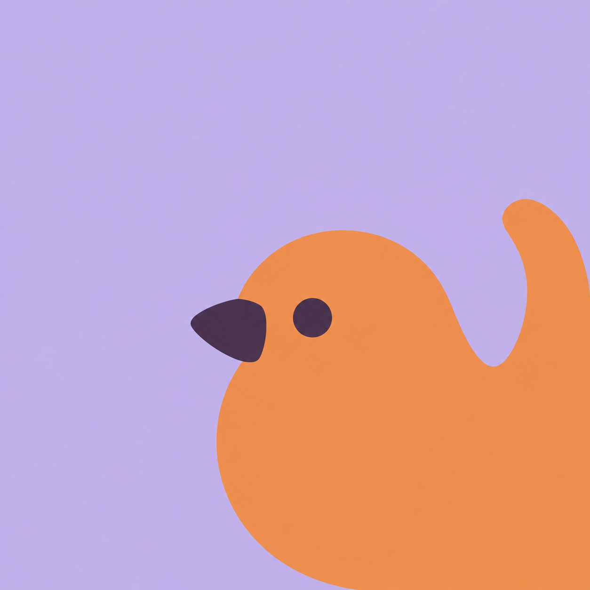
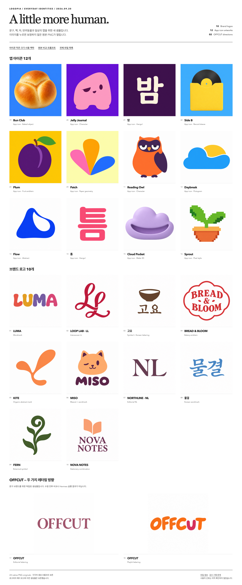

# Visual gallery

[English](gallery.md) · [한국어](gallery.ko.md) · [Docs](README.md) · [Logopia](../README.md)

[Rejected October experiments](#showcase) · [Logopia identity](#identity) · [Earlier outputs](#historical-outputs)

## October experiments — user rejected design quality

**The user rejected the design quality of all six October 1 results.** They were not accepted as meaningfully improved or ready for production. Output-quality improvement remains unproven; the originals, requests and revision history are preserved for inspection.

<table>
  <tr>
    <td align="center" width="50%"> <strong>mori</strong> Latin wordmark · Plant subscription</td>
    <td align="center" width="50%"> <strong>사이</strong> Hangul wordmark · Reading club</td>
  </tr>
  <tr>
    <td align="center" width="50%"> <strong>AL</strong> Integrated monogram · Architecture studio</td>
    <td align="center" width="50%"> <strong>Tandem</strong> Abstract symbol · Shared planning</td>
  </tr>
  <tr>
    <td align="center" width="50%"> <strong>pebble</strong> Symbol + wordmark · Walking journal</td>
    <td align="center" width="50%"> <strong>Pip</strong> Character app icon · Daily voice notes</td>
  </tr>
</table>

| Example | Use case | Saved native prompt |
|---|---|---|
| **mori** | Latin wordmark for plant subscription | [Prompt](showcase/2026-10-01-use-cases/prompts/01-mori.txt) |
| **사이** | Hangul wordmark for reading club | [Prompt](showcase/2026-10-01-use-cases/prompts/02-sai.txt) |
| **AL** | Integrated monogram for architecture studio | [Prompt](showcase/2026-10-01-use-cases/prompts/03-al.txt) |
| **Tandem** | Abstract symbol for shared planning | [Prompt](showcase/2026-10-01-use-cases/prompts/04-tandem.txt) |
| **pebble** | Symbol + wordmark for walking journal | [Prompt](showcase/2026-10-01-use-cases/prompts/05-pebble.txt) |
| **Pip** | Character app icon for daily voice notes | [Prompt](showcase/2026-10-01-use-cases/prompts/06-pip.txt) |

[Requests, originals and limitations](showcase/2026-10-01-use-cases/README.md) · [Offline HTML gallery](showcase/2026-10-01-use-cases/index.html)

[Focused comparison after rejection](showcase/2026-10-01-pebble-study/README.md) · [Offline comparison](showcase/2026-10-01-pebble-study/index.html) — stopped without demonstrated overall design improvement; no candidate was adopted.

The 0.10.0 source remains unreleased. Browser QA checked gallery usability only, not design acceptance. All brands are fictional, with no affiliation or trademark-clearance claim. Outputs are raster PNGs.

## Logopia identity

Original game-title lettering: rounded, colorful lowercase **logopia** on white. [Open the original PNG](../assets/logopia-game-title.png) · [Identity and downloads](brand/README.md)

## Earlier outputs — preserved archive

These images remain historical records. Rejection of the October experiments does not make earlier work a newly endorsed quality benchmark.

## Historical: everyday identities — September 20, 2026

Ten brand logos, twelve app icon artworks and two OFFCUT lettering directions generated on September 20. These historical samples predate the 0.9.0 and 0.10.0 source updates. Their original files and prompts remain available below.

  

[Open the board](showcase/2026-09-20-lifestyle/board.png) · [All sample files](showcase/2026-09-20-lifestyle/README.md) · [Local HTML gallery](showcase/2026-09-20-lifestyle/index.html)

OFFCUT’s [editorial](showcase/2026-09-20-lifestyle/images/00-offcut-editorial.png) and [playful](showcase/2026-09-20-lifestyle/images/00-offcut-playful.png) lettering are separate directions. Open the [icon size/context diagnostics](showcase/2026-09-20-lifestyle/diagnostics.html) for the twelve app artworks.

### Ten brand logos

| Name | Form | Original PNG |
|---|---|---|
| LUMA | Wordmark | [Open](showcase/2026-09-20-lifestyle/images/01-luma.png) |
| LOOP LAB · LL | Monogram | [Open](showcase/2026-09-20-lifestyle/images/02-loop-lab.png) |
| 고요 | Symbol + Korean lettering | [Open](showcase/2026-09-20-lifestyle/images/03-goyo.png) |
| BREAD & BLOOM | Emblem | [Open](showcase/2026-09-20-lifestyle/images/04-bread-bloom.png) |
| KITE | Abstract mark | [Open](showcase/2026-09-20-lifestyle/images/05-kite.png) |
| MISO | Mascot + wordmark | [Open](showcase/2026-09-20-lifestyle/images/06-miso.png) |
| NORTHLINE · NL | Lettermark | [Open](showcase/2026-09-20-lifestyle/images/07-northline.png) |
| 물결 | Korean wordmark | [Open](showcase/2026-09-20-lifestyle/images/08-mulgyeol.png) |
| FERN | Pictorial symbol | [Open](showcase/2026-09-20-lifestyle/images/09-fern.png) |
| NOVA NOTES | Stationery combination | [Open](showcase/2026-09-20-lifestyle/images/10-nova-notes.png) |

### Twelve app icon artworks

| Name | Form | Original PNG |
|---|---|---|
| Reading Owl | IP character | [Open](showcase/2026-09-20-lifestyle/images/11-reading-owl.png) |
| Daybreak | Pictogram | [Open](showcase/2026-09-20-lifestyle/images/12-weather.png) |
| Flow | Abstract icon | [Open](showcase/2026-09-20-lifestyle/images/13-flow.png) |
| 틈 | Korean monogram | [Open](showcase/2026-09-20-lifestyle/images/14-notes.png) |
| Cloud Pocket | Soft 3D | [Open](showcase/2026-09-20-lifestyle/images/15-cloud.png) |
| Sprout | Pixel art | [Open](showcase/2026-09-20-lifestyle/images/16-sprout.png) |
| Bun Club | tactile baked object | [Open](showcase/2026-09-20-lifestyle/images/17-bun-club.png) |
| Jelly Journal | expressive asymmetric flat character | [Open](showcase/2026-09-20-lifestyle/images/18-jelly.png) |
| 밤 | compact warm Hangul lettering | [Open](showcase/2026-09-20-lifestyle/images/19-bam.png) |
| Side B | tactile record sleeve | [Open](showcase/2026-09-20-lifestyle/images/20-side-b.png) |
| Plum | organic flat fruit emblem | [Open](showcase/2026-09-20-lifestyle/images/21-plum.png) |
| Patch | modular paper-petal composition | [Open](showcase/2026-09-20-lifestyle/images/22-patch.png) |

These are raster PNG examples. See the [manifest](showcase/2026-09-20-lifestyle/manifest.json) for actual dimensions and file details. Editable vectors, font files and platform-specific app icon packages require separate work.

[Previous white collection](showcase/2026-09-white/README.md) · [Historical Hermes OFFCUT case](hermes-demo/README.md)

[September 2026 colored showcase](showcase/2026-09/README.md) · [Its original file inventory](showcase/2026-09/manifest.json)

The images below belong to earlier collections and experiments. Their original files, prompts, observations and packages remain attached to those earlier outputs. They are not the source records or review results for the October experiment archive.

[Comparison study](#new-samples) · [10 earlier brands](#brands) · [16 earlier app icons](#app-icons) · [8 color cases](#colors) · [Earlier identities](#historical-identity)

Failed and indeterminate attempts remain alongside reviewed results. The descriptions retain their recorded limitations.

## Earlier comparison study: six directions and two refinements

Six initial originals plus two refinements based on the Relay and Sprig originals. These are creative comparisons, with no candidate selected or approved for delivery. The descriptions summarize the generator’s observations of originals and small sizes; they do not establish improvement across all results.

### Leaflet · reading fox

**v1 original**

A friendly reading companion. The book merges with the body at 32px; cream features introduce a third character color family beyond the two-color intent.

[v1 saved prompt](gallery-workflow/prompts/leaflet-v1.txt)

### Drip · water reminder

**v1 original**

The droplet and water opening remain legible at 32px, while the right interior tip becomes thin. Subtle tonal variation remains despite the flat-color intent.

[v1 saved prompt](gallery-workflow/prompts/drip-v1.txt)

### Relay · quiet handoff

**v1 original → v2 refinement**

Keep the two offset arcs and their colors; widen only the central opening. The child widens that passage, with a modest difference at 32px, but also changes the terracotta arc beyond the requested end trim. Mixed result; exact shape preservation is not established.

[v1 saved prompt](gallery-workflow/prompts/relay-v1.txt) · [v2 saved prompt](gallery-workflow/prompts/relay-v2.txt)

### 틈 · notes

**v1 original**

The single Korean syllable 틈 is readable; narrow horizontal gaps compress at 32px. The rounded lettering is an observed appearance, not verified font composition.

[v1 saved prompt](gallery-workflow/prompts/teum-v1.txt)

### Sprig · gentle plant care

**v1 original → v2 refinement**

Keep the asymmetric jade leaf and matte material; clarify its lower join and bend the stem left. The child cleans the join slightly, but the requested leftward bend is not clear. Recognition at 32px is mostly unchanged; no small-size gain is demonstrated.

[v1 saved prompt](gallery-workflow/prompts/sprig-v1.txt) · [v2 saved prompt](gallery-workflow/prompts/sprig-v2.txt)

### COMMON · shared workspace

**v1 original**

An open meeting-space symbol accompanies the exact COMMON wordmark. The full lockup is readable around 128px wide, but unsuitable as a 32px favicon; use a wider header. No actual font-file usage is established.

[v1 saved prompt](gallery-workflow/prompts/common-v1.txt)

[Saved sources and keep/change notes](gallery-workflow/samples.json) retain each candidate’s record.

## Earlier ten brand logos

The earlier ten fictional brands, all with opaque original backgrounds. These are separate from the September 2026 showcase above; the linked briefs and packages describe these earlier images.

### LUMA · Wordmark

[Request and downloads](samples/items/01-luma/README.md)

### LOOP LAB · Monogram

[Request and downloads](samples/items/02-loop-lab/README.md)

### 고요 · Symbol + Korean lettering

[Request and downloads](samples/items/03-goyo/README.md)

### BREAD & BLOOM · Emblem

[Request and downloads](samples/items/04-bread-bloom/README.md)

### KITE · Abstract

[Request and downloads](samples/items/05-kite/README.md)

### MISO · Mascot

[Request and downloads](samples/items/06-miso/README.md)

### NORTHLINE · NL · Lettermark

[Request and downloads](samples/items/07-northline/README.md)

### 물결 · Korean wordmark

[Request and downloads](samples/items/08-mulgyeol/README.md)

### FERN · Symbol

[Request and downloads](samples/items/09-fern/README.md)

### NOVA NOTES · Combination

[Request and downloads](samples/items/10-nova-notes/README.md)

## Earlier sixteen app icon originals

Six IP candidates and five original/revised direction pairs. A revised direction is not a claim of improvement in every respect.

### IP characters

**Reading owl · lower-left / lower-right**

[Left candidate details](app-icons/samples/ip-a1.md) · [Right candidate details](app-icons/samples/ip-a2.md)

**Calm reading capybara · lower-left / lower-right**

[Left candidate details](app-icons/samples/ip-b1.md) · [Right candidate details](app-icons/samples/ip-b2.md)

**Friendly reading puppy · lower-left / lower-right**

[Left candidate details](app-icons/samples/ip-c1.md) · [Right candidate details](app-icons/samples/ip-c2.md)

### Weather · sun and cloud

**Original → revised direction**

[Request and original details](app-icons/samples/pictogram.md)

### Focus · interlocking arcs

**Original → revised direction**

[Request and original details](app-icons/samples/abstract.md)

### Notes · 모

**Original → revised direction**

[Request and original details](app-icons/samples/monogram.md)

### Plant care · jade leaf

**Original → revised direction**

[Request and original details](app-icons/samples/soft-3d.md)

### Timer · hourglass

**Original → revised direction**

[Request and original details](app-icons/samples/pixel-art.md)

## Earlier colors and lettering: eight cases

All 17 stored originals across seven projects are shown. GROVE original/warmer count as two cases; the 밤결 parent appears again for the white comparison. Images follow each stated version sequence.

### SUNROOM

Original; the small BAKERY subtitle failed review. No delivery package.

[Case details and available files](colors/projects/sunroom/README.md)

### NORTHLINE

Reviewed original; PNG, ZIP and guide are available.

[Case details and available files](colors/projects/northline/README.md)

### GROVE SUPPLY · original and warmer revision

a-v1 → a-v2 → a-v3 → a-v4. a-v1 is the delivered transparent original. The warmer attempts a-v2, a-v3 and a-v4 all have opaque checkerboards, with no approved transparent delivery. A green-anchor color pass is not a strict two-color pass.

[Case details and available files](colors/projects/grove/README.md)

### 밤결

a-v1 → a-v2 → a-v3. Restricted-color original: indeterminate; both repair attempts: color mismatch and opaque checkerboards. These are preserved originals, not validated deliveries.

[Case details and available files](colors/projects/bamgyeol/README.md)

### TIDE & TYPE

Reviewed original using SUNROOM as a color reference; PNG, ZIP and guide are available. Check fine serifs at the intended size.

[Case details and available files](colors/projects/tide/README.md)

### FIELD NOTE

a-v1 → a-v2 → a-v3. Two-color original: indeterminate; both repair attempts: color mismatch and opaque checkerboards. No approved package.

[Case details and available files](colors/projects/fieldnote/README.md)

### 밤결 · white revision

parent-v1 → white-v1 → white-v2 → white-v3. The parent is the existing 밤결 original, shown again to compare the white revisions. All white attempts remain indeterminate; no approved transparent delivery or ZIP. Indeterminate does not establish a visible defect.

[Case details and available files](colors/projects/white-bamgyeol/README.md)

## Earlier identities — archived originals

### Previous open-frame identity

The previous open-frame design has an opaque ivory background. Its [historical brand guide](brand/2026-identity/delivery/brand-guide.md) describes that image, not the current lettering master. See [current identity and downloads](brand/README.md). For a transparent example, see [GROVE a-v1 above](#colors-grove) and [background guidance](samples/transparency.md).

### Archived earlier identity · opaque original → transparent revision

These belong to the earlier identity, not the current brand. The transparent revision is documented for light surfaces. [Earlier identity archive](brand/legacy.md) · [Earlier transparency record](transparency/README.md)

## Local comparison and credits

Compare candidates across projects in app-home, website-header and 16px previews. Retain each source with keep/change notes, then refine the chosen original. Copying notes does not select a candidate or approve delivery. Contexts are illustrative layouts, not platform-specific files.

[Earlier candidate comparison HTML: download/open locally](gallery-workflow/comparison/index.html)

GitHub displays the images in this Markdown gallery directly. For interactive HTML, download the repository and open the file locally. [App icon comparison HTML: download/open locally](app-icons-quality-v1/index.html) · [Color comparison HTML: download/open locally](colors/index.html)

IP character guidance is adapted from [s1dashu/ip-as-logo-skill](https://github.com/s1dashu/ip-as-logo-skill). [Pinned adaptation reference](../skills/logo-land/references/ip-mascot.md) · [MIT license notice](../skills/logo-land/assets/ip-as-logo.LICENSE) · [Third-party notices](../THIRD_PARTY_NOTICES.md)
